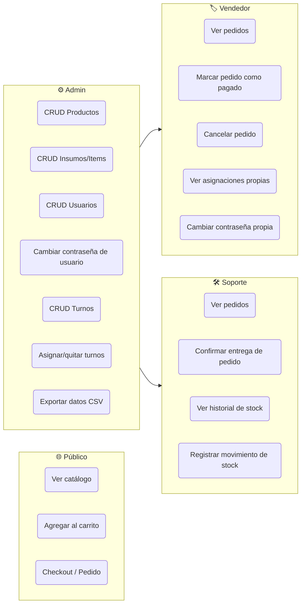
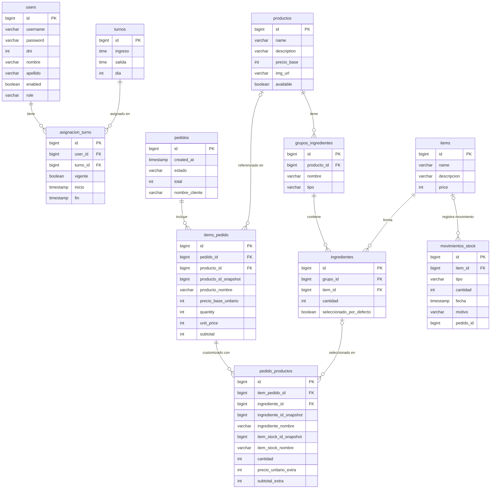

## 1. Casos de Uso

### Diagrama de casos de uso

```mermaid
flowchart LR
    subgraph Pub["🌐 Público"]
        direction LR
        A1(Ver catálogo)
        A2(Agregar al carrito)
        A3(Checkout / Pedido)
    end

    subgraph Vend["🏷️ Vendedor"]
        direction LR
        V1(Ver pedidos)
        V2(Marcar pedido como pagado)
        V3(Cancelar pedido)
        V4(Ver asignaciones propias)
        V5(Cambiar contraseña propia)
    end

    subgraph Sop["🛠️ Soporte"]
        direction LR
        S1(Ver pedidos)
        S2(Confirmar entrega de pedido)
        S3(Ver historial de stock)
        S4(Registrar movimiento de stock)
    end

    subgraph Adm["⚙️ Admin"]
        direction LR
        D1(CRUD Productos)
        D2(CRUD Insumos/Items)
        D3(CRUD Usuarios)
        D4(Cambiar contraseña de usuario)
        D5(CRUD Turnos)
        D6(Asignar/quitar turnos)
        D7(Exportar datos CSV)
    end

    Adm --> Vend
    Adm --> Sop
```

---

## 2. Diagrama de la Base de Datos

```mermaid
erDiagram
    users {
        bigint id PK
        varchar username
        varchar password
        int dni
        varchar nombre
        varchar apellido
        boolean enabled
        varchar role
    }
    turnos {
        bigint id PK
        time ingreso
        time salida
        int dia
    }
    asignacion_turno {
        bigint id PK
        bigint user_id FK
        bigint turno_id FK
        boolean vigente
        timestamp inicio
        timestamp fin
    }
    productos {
        bigint id PK
        varchar name
        varchar description
        int precio_base
        varchar img_url
        boolean available
    }
    grupos_ingredientes {
        bigint id PK
        bigint producto_id FK
        varchar nombre
        varchar tipo
    }
    items {
        bigint id PK
        varchar name
        varchar descripcion
        int price
    }
    ingredientes {
        bigint id PK
        bigint grupo_id FK
        bigint item_id FK
        int cantidad
        boolean seleccionado_por_defecto
    }
    pedidos {
        bigint id PK
        timestamp created_at
        varchar estado
        int total
        varchar nombre_cliente
    }
    items_pedido {
        bigint id PK
        bigint pedido_id FK
        bigint producto_id FK
        bigint producto_id_snapshot
        varchar producto_nombre
        int precio_base_unitario
        int quantity
        int unit_price
        int subtotal
    }
    pedido_productos {
        bigint id PK
        bigint item_pedido_id FK
        bigint ingrediente_id FK
        bigint ingrediente_id_snapshot
        varchar ingrediente_nombre
        bigint item_stock_id_snapshot
        varchar item_stock_nombre
        int cantidad
        int precio_unitario_extra
        int subtotal_extra
    }
    movimientos_stock {
        bigint id PK
        bigint item_id FK
        varchar tipo
        int cantidad
        timestamp fecha
        varchar motivo
        bigint pedido_id
    }

    users ||--o{ asignacion_turno : "tiene"
    turnos ||--o{ asignacion_turno : "asignado en"
    productos ||--o{ grupos_ingredientes : "tiene"
    grupos_ingredientes ||--o{ ingredientes : "contiene"
    items ||--o{ ingredientes : "forma"
    items o|--o{ movimientos_stock : "registra movimiento"
    pedidos ||--o{ items_pedido : "incluye"
    productos o|--o{ items_pedido : "referenciado en"
    items_pedido ||--o{ pedido_productos : "customizado con"
    ingredientes o|--o{ pedido_productos : "seleccionado en"
```

